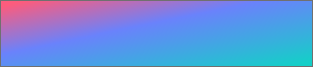

### Hi there 👋

<!-- ### Plans, plans, plans ... -->

<link rel="stylesheet" href="https://github.com/maxzz/maxzz/src/css/style.css">
<!-- <link rel="stylesheet" href="src/css/style.css"> -->

<!--  -->

<!--  -->

<!-- recent_releases starts -->
Repo | created | updated
-|-|-
[maxzz](https://github.com/maxzz/maxzz) | 2020-07-18T22:15:47Z | 2020-08-04T09:37:02Z
[netsh-rule](https://github.com/maxzz/netsh-rule) | 2020-07-13T03:45:29Z | 2020-07-20T03:28:51Z
[maxzz-python](https://github.com/maxzz/maxzz-python) | 2020-07-18T01:33:44Z | 2020-07-18T22:15:06Z
[test-pm](https://github.com/maxzz/test-pm) | 2020-05-28T12:19:35Z | 2020-06-21T01:24:21Z
[ch-spy](https://github.com/maxzz/ch-spy) | 2020-06-16T07:54:08Z | 2020-06-17T04:04:14Z
[gluehtml](https://github.com/maxzz/gluehtml) | 2020-05-27T04:53:26Z | 2020-05-30T03:55:35Z
[http-wrapper-example](https://github.com/maxzz/http-wrapper-example) | 2020-05-26T01:28:18Z | 2020-05-26T01:28:20Z
[css-effects-snippets](https://github.com/maxzz/css-effects-snippets) | 2020-05-19T10:51:50Z | 2020-05-19T10:51:51Z
[mande](https://github.com/maxzz/mande) | 2020-05-19T10:51:05Z | 2020-05-19T10:51:07Z
[json-ts](https://github.com/maxzz/json-ts) | 2020-05-17T03:51:50Z | 2020-05-17T03:51:52Z
[ngon-gen](https://github.com/maxzz/ngon-gen) | 2020-05-12T10:23:11Z | 2020-05-17T02:52:08Z
[vue-evens-todos](https://github.com/maxzz/vue-evens-todos) | 2020-05-04T05:14:26Z | 2020-05-04T05:14:33Z
[react-lifecycles](https://github.com/maxzz/react-lifecycles) | 2020-03-29T10:04:19Z | 2020-03-29T10:17:55Z
[myFlix](https://github.com/maxzz/myFlix) | 2020-03-18T10:44:54Z | 2020-03-27T09:41:31Z
[VueSolitaire](https://github.com/maxzz/VueSolitaire) | 2020-03-21T02:15:23Z | 2020-03-21T02:15:25Z
[test-graphql](https://github.com/maxzz/test-graphql) | 2020-03-16T03:45:58Z | 2020-03-16T03:46:26Z
[giffy](https://github.com/maxzz/giffy) | 2020-03-15T04:00:58Z | 2020-03-15T04:11:58Z
[maxzz-proxy](https://github.com/maxzz/maxzz-proxy) | 2020-01-04T09:41:03Z | 2020-01-06T01:56:46Z
[har-extractor](https://github.com/maxzz/har-extractor) | 2019-02-20T09:45:42Z | 2019-02-20T09:45:44Z
[ace-builds](https://github.com/maxzz/ace-builds) | 2017-05-18T08:28:51Z | 2017-05-18T08:28:56Z
[tanx-1](https://github.com/maxzz/tanx-1) | 2016-01-11T08:06:51Z | 2016-01-11T08:06:51Z
[ThreeJSEditorExtension](https://github.com/maxzz/ThreeJSEditorExtension) | 2016-01-11T03:07:12Z | 2016-01-11T03:07:13Z
<!-- recent_releases ends -->

<!--
**maxzz/maxzz** is a ✨ _special_ ✨ repository because its `README.md` (this file) appears on your GitHub profile.

Here are some ideas to get you started:

- 🔭 I’m currently working on ...
- 🌱 I’m currently learning ...
- 👯 I’m looking to collaborate on ...
- 🤔 I’m looking for help with ...
- 💬 Ask me about ...
- 📫 How to reach me: ...
- 😄 Pronouns: ...
- ⚡ Fun fact: ...
-->
<!--
https://www.aboutmonica.com/blog/how-to-create-a-github-profile-readme
https://simonwillison.net/2020/Jul/10/self-updating-profile-readme/

test

ccc

-->
<!--
<table><tr>
  <td valign="top" width="1%">
    max
  </td>
  </tr></table>

div

[@maxzz](https://github.com/maxzz) | 
-|-
-->

